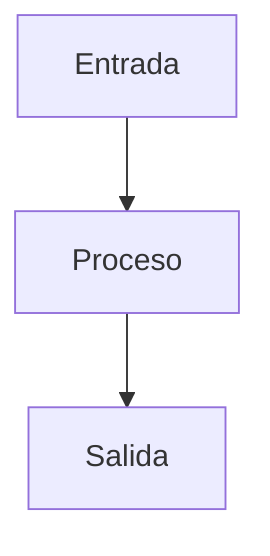

## ✅ Algoritmos:

El vocablo algoritmo es de origen árabe y proviene del sobrenombre del matemático Al-Khowarizmi. Cuando escuchan la palabra algoritmo,
las personas frecuentemente consideran que es demasiado sofisticada y exclusivamente relacionada con las ciencias. Sin embargo,
los algoritmos están ampliamente relacionados con nuestra vida cotidiana y con nuestro quehacer profesional. **Un 
algoritmo es una serie de pasos ordenados que se siguen para resolver un problema de forma detallada, definida, precisa y finita**.
En la vida cotidiana se emplean algoritmos ampliamente, por ejemplo, en las
recetas para preparar platillos.

Aquí te presento un ejemplo de un algoritmo sencillo para hacer un sándwich de jamón y queso: 🥪

Ingredientes:

+ 🍞Pan de molde
+ 🍖Jamón cocido
+ 🧀Queso en lonchas
+ 🧈Mantequilla o margarina

Instrucciones:

+ 1️⃣ Tostar el pan de molde en una tostadora o en una sartén caliente.
+ 2️⃣ Untar mantequilla o margarina en una de las rebanadas de pan tostado.
+ 3️⃣ Colocar una loncha de queso y una de jamón encima de la rebanada de pan con la mantequilla o margarina.
+ 4️⃣ Cubrir con la otra rebanada de pan tostado.
+ 5️⃣ Cortar el sándwich en dos mitades si lo deseas.
+ 6️⃣ Servir y disfrutar.

## ❗ Clasificacion de Algoritmos

🏃‍♀️🏃‍♂️ Algoritmos Cualitativos: Son todos aquellos algoritmos en los que los pasos que lo componen se describen de una forma narrada con lenguaje natural.
Un Algoritmo es una secuencia de pasos ordenados logicos que se llevan a cabo con el objeto de resolver un problema determinado. Un ejemplo de ello
es la receta anterior mencionada.

➕➖ Algoritmos Cuantitativos: Son aquellos algoritmos que utilizan operaciones algebraicas y calculos numericos especificos para definir un proceso obteniendo valores concretos. Por ejemplo:

+ 1️⃣ Solicitar al usuario que ingrese su fecha de nacimiento en el formato "dd/mm/aaaa".
+ 2️⃣ Obtener la fecha actual del sistema.
+ 3️⃣ Calcular la diferencia entre la fecha actual y la fecha de nacimiento.
+ 4️⃣ Convertir la diferencia de fechas a años completos.
+ 5️⃣ Mostrar el resultado de la edad calculada en años completos.

## ❗ Estructura de un Algoritmo

Todo algoritmo consta de tres secciones principales:

⬇ **Entrada o inicio**: Es la introducción de datos para ser transformados.

🔁 **Procesos o acciones**: Es el conjunto de operaciones a realizar para dar
solución al problema.

☑ **Salida o resultados**: Son los resultados obtenidos a través del proceso.
                

Tomando como ejemplo la receta del Sandwich:

Entrada:

+ 🍞Pan de molde
+ 🍖Jamón cocido
+ 🧀Queso en lonchas
+ 🧈Mantequilla o margarin
 
Proceso:

+ 1️⃣ Tostar el pan de molde en una tostadora o en una sartén caliente.
+ 2️⃣ Untar mantequilla o margarina en una de las rebanadas de pan tostado.
+ 3️⃣ Colocar una loncha de queso y una de jamón encima de la rebanada de pan con la mantequilla o margarina.
+ 4️⃣ Cubrir con la otra rebanada de pan tostado.
+ 5️⃣ Cortar el sándwich en dos mitades si lo deseas.

Resultado:

+ 🥪 Un delicioso sándwich de jamón y queso.

## 🌐 Enlaces Complementarios

 + 🎥 [¿Qué es un Algoritmo?(2:32min.)](https://www.youtube.com/watch?v=EkObhToiseo&ab_channel=GCFAprendeLibre)
 + 📄 [¿Qué es un Algoritmo?(-5min. de lectura)](https://concepto.de/algoritmo-en-informatica/)

😁 by Izzy
