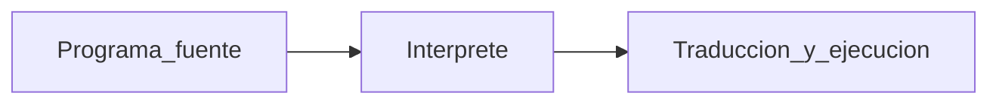
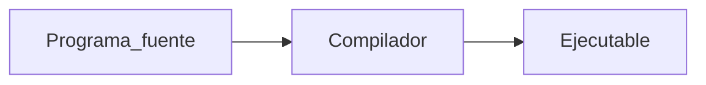

## 💻 Conceptos Básicos de Programación

En el momento que utilizamos una computadora, un celular o jugamos un videojuego, dentro de toda la maquinaria informatica, se estan ejecutando conjuntos o bloques de instrucciones las cuales son 
escritas en determinados **lenguajes de programación** las que hacen posible las demandas o solicitudes del usuario.

### ❗  lenguaje de programación

Un lenguaje de programación es un idioma artificial creado para indicarle a la computadora lo que debe hacer. Tiene ciertas reglas de escritura (sintaxis) en las que
utiliza símbolos y palabras clave, además de una semántica (interpretación interna).

La **SINTAXIS** en programación es el conjunto de reglas que definen la manera de escribir instrucciones de código. Cada lenguaje de programación tiene su propia sintaxis, 
es por eso que no es conveniente estudiar la programación basándose puramente en la escritura del código, sino entendiendo la manera de pensar, los conceptos básicos,
conocer las estructuras de control y cómo aplicarlas; de esta forma se aprende programación independientemente del lenguaje y luego, dependiendo la aplicación, se 
estudia la sintaxis del lenguaje que se necesite, algo que nos puede tomar algunas horas o un día de dedicación.

Ejemplo: 

#### 💛 JavaScript: Muestra un mensaje
```javascript
var s = "Hola Mundo!";
alert(s);
```
 
#### 💚 Python: Muestra un mensaje 
```python
s = "Hola Mundo!"
print s
```

### ❗ Programa

Un programa es un bloque de instrucciones (código fuente) escritas en cierto lenguaje de programación cuyo propósito es resolver un problema.

Ejemplo:

Programa en Java que sume 12 y 15 y muestre el resultado por pantalla:

```java
public class Suma {
  public static void main(String[] args) {
    int a = 12;
    int b = 15;
    int resultado = a + b;
    System.out.println("La suma de " + a + " y " + b + " es igual a " + resultado);
  }
}
```

Resultado:
```css
La suma de 12 y 15 es igual a 27
```

### ❗ Ejecucion de un programa

Para ejecutar un programa la computadora realiza una traducción de sus componentes al lenguaje máquina, es decir, convierte las instrucciones en cadenas de ceros y unos. Este proceso de conversión puede hacerse de dos formas:

 + 🅰) Intérprete: Un programa que se ejecuta instrucción por instrucción en tiempo real.
 + 🅱) Compilado: Para ejecutarse necesita ser compilado, es decir, que toma al bloque de instrucciones lo traduce sólo una vez y lo ejecuta.

#### Interprete 


#### Compilador


Ejemplos de lenguajes compilados y de interprete:

| Compilado | Interpretado  |
|:-------------:|:-------------:|
| COBOL      | Php |
| C++      | Javascript  |
| Visual Basic | Python   |
